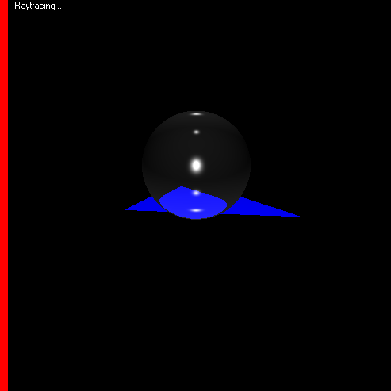

# Raytracing-Engine
This is a hobby project developed back in 2002 using Visual Basic 6 and Direct 3D.

It started with implementing various 3D rendering algorithms (specifically Gouraud and Phong shading) and ended up implementing a full raytracing engine from scratch. It supports rendering 3D objects created with 3D Studio Max.

The main raytracing algorithm is implemented [here](DirectWorld/RayTrace.bas).

###### A few sample images

